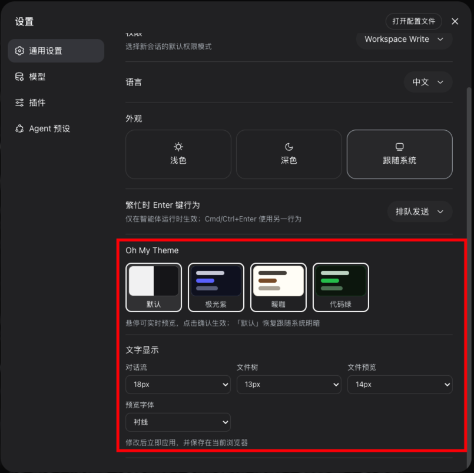
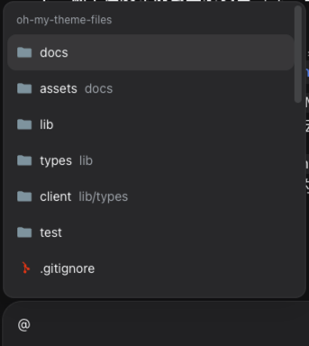
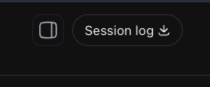
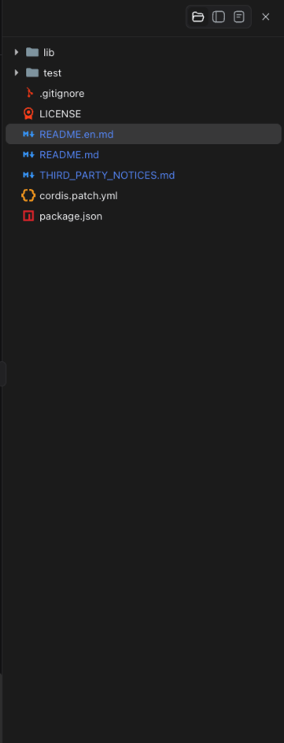
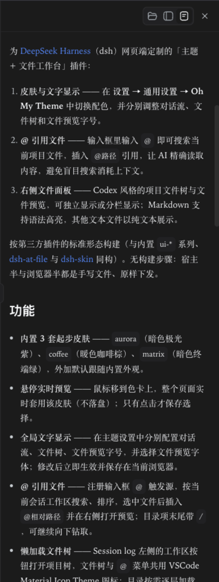
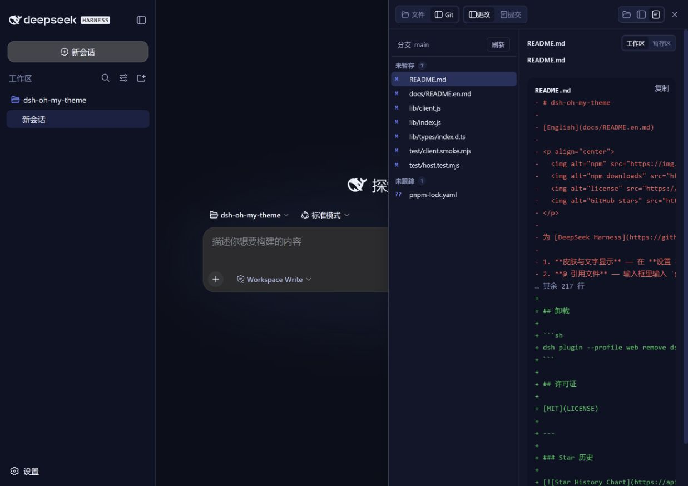
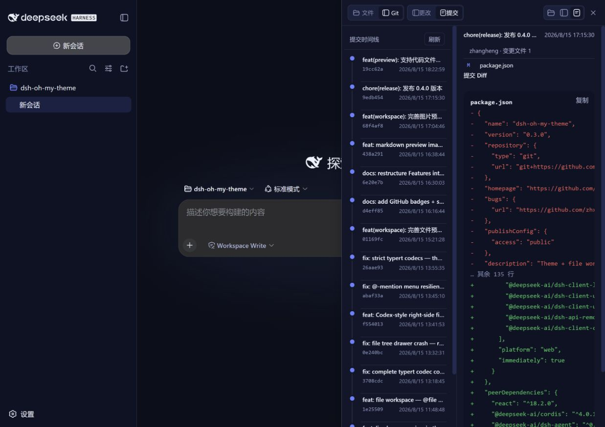

# dsh-oh-my-theme

[English](docs/README.en.md)

<p align="center">
  
  
  
  
  <a href="https://awesome-dsh-plugin.com"></a>

</p>

为 [DeepSeek Harness](https://github.com/deepseek-ai/deepseek-harness)（dsh）网页端定制的「主题 + 文件工作台」插件：

1. **皮肤与文字显示** —— 在 **设置 → 通用设置 → Oh My Theme** 中切换配色，并分别调整对话流、文件树和文件预览字号。
2. **@ 引用文件** —— 输入框里输入 `@` 即可搜索当前项目文件，插入 `@路径` 引用，让 AI 精确读取内容，避免盲目搜索消耗上下文。
3. **右侧文件面板** —— Codex 风格的项目文件树与文件预览，可独立显示或分栏显示；Markdown 与常见代码文件支持语法高亮，未知文本格式回退为纯文本。

按第三方插件的标准形态构建（与内置 `ui-*` 系列、[dsh-at-file](https://github.com/FSMargoo/dsh-at-file) 与 [dsh-skin](https://github.com/KinGao294/dsh-skin) 同构）。无构建步骤：宿主半与浏览器半都是手写文件、原样下发。

## 功能

### 🎨 主题与文字显示

> 在 **设置 → 通用设置 → Oh My Theme** 中切换配色，并分别调整对话流、文件树和文件预览的字号与字体。

- **内置 3 套起步皮肤** —— `aurora`（暗色极光紫）、`coffee`（暖色咖啡棕）、`matrix`（暗色终端绿），外加默认跟随内置外观。
- **悬停实时预览** —— 鼠标移到色卡上，整个页面实时套用该皮肤（不落盘）；只有点击才保存选择。
- **全局文字显示** —— 对话流、文件树、文件预览字号可分别配置，预览字体可自定义；修改后立即生效并保存在当前浏览器。



### ✨ @ 引用文件

> 在输入框输入 `@` 搜索当前项目文件，插入 `@路径` 引用，让 AI 精确读取内容，避免盲目搜索消耗上下文。

- 按当前会话工作区搜索、排序；选中文件后插入 `@相对路径 `，点击输入框中的引用文本后才打开右侧预览。
- 目录项末尾带 `/`，输入 `@src/` 可继续向下钻取。



### 📁 右侧文件面板（Codex 风格）

> 点击 Session log 左侧的工作区按钮打开。可切换「仅项目文件 / 文件与预览分栏 / 仅文件预览」，Markdown 与常见代码文件支持语法高亮。

- **懒加载文件树** —— 目录按需逐层加载，自动跳过 `node_modules` / `.git` / 构建产物目录；文件树与 `@` 菜单共用 VSCode Material Icon Theme 图标。
- **快速打开文件** —— 在面板中点击搜索按钮，或按 `Ctrl/Cmd + P`，按文件名或路径筛选并回车打开；索引会复用 `@` 引用的工作区缓存。
- **多文件预览标签** —— 连续打开多个文件时保留独立预览标签，可切换或关闭；标签只在当前会话内有效，按需读取文件内容。
- **隐藏依赖过滤** —— 点文件、隐藏文件及依赖/构建目录（包括 `node_modules`、`.pnpm`、`.git`、`dist` 等）不会出现在文件树或 `@` 菜单中。
- **独立视图** —— 面板标题栏可切换「仅项目文件 / 分栏 / 仅文件预览」三种布局。
- **Markdown 与代码预览** —— `.md` 使用 dsh 的 Markdown 渲染器；JS/TS/TSX、JSON、HTML/CSS、Vue、Python、Go、Rust、Java、Shell、YAML、SQL、Dockerfile 等常见代码文件复用 Shiki 高亮和复制按钮；未知 UTF-8 文本回退为纯文本（512KB 上限、二进制拒绝读取）。

| 工作区入口 | 文件面板 | Markdown 预览 |
| --- | --- | --- |
|  |  |  |

> **数据存放位置**：皮肤、字号、字体等偏好保存在当前浏览器的 `localStorage` 中，不会影响会话数据。

### Git 记录（只读）

> 在同一个右侧工作台中切换「文件 / Git」，进入 Git 后再切换「更改 / 提交」，查看当前工作区的 Git 状态和历史，不执行任何写操作。

- **更改视图** —— 按已暂存、未暂存、未跟踪分组，显示状态码；点击文件后通过现有 `DiffBlock` 组件预览工作区或暂存区 Diff，未跟踪文件也会生成 Diff。
- **提交时间线** —— 从所有本地和远程 refs 分页加载当前工作区涉及的提交，以纵向时间线展示短哈希、主题、作者、时间和分支标签；选择提交后查看变更文件列表与提交 Diff，也可以单独查看某个文件。
- **宿主安全边界** —— 只开放固定的 `git status` / `diff` / `log` / `show` 只读命令，路径限制在当前会话工作区，commit hash 做格式校验，命令有超时和输出上限。

<p align="center">
  
  
</p>


### DeepSeek 实时余额

> 在输入框下方的会话统计栏查看实时余额，点击金额可打开详情；本功能只展示实时余额，不计算单次消费。

- 宿主端通过 DSH credentials 服务解析 `DEEPSEEK_API_KEY`，调用官方 `/user/balance` 接口。
- 浏览器只收到 `CNY` / `USD` 的总余额、赠送余额、充值余额和更新时间，API key 不会进入客户端或日志。
- 余额会在宿主远程服务挂载后自动读取，也支持手动刷新；未配置密钥或宿主尚未重启时显示明确提示。
- 默认不轮询，避免后台频繁请求；点击刷新时才发起一次轻量 HTTPS 请求。

## 安装

本插件是标准 dsh bundle。发布到 npm 后，使用包名安装到 `web` profile：

```sh
dsh plugin --profile web add dsh-oh-my-theme
```

本地开发或尚未发布时，也可以按项目路径安装：
```sh
# 在项目根目录安装
dsh plugin --profile web add .
# 或在任意位置按绝对路径安装
dsh plugin --profile web add /path/to/dsh-oh-my-theme
```

然后启动网页端：

```sh
dsh web
```

## 使用

### 皮肤

打开 **设置 → 通用设置**，「Oh My Theme」行位于内置「外观」行下方。把鼠标移到色卡上可实时预览整个页面的效果（此时不会保存）；点击才确认生效。同一区域还可分别设置对话流、文件树、文件预览字号以及预览字体，修改后立即生效并保存在当前浏览器中。「默认」恢复跟随内置外观。

### @ 引用文件

在输入框输入 `@` 并继续输入路径片段 —— 弹出菜单列出当前项目的匹配文件和目录。选中文件会插入 `@路径 `；点击输入框中的引用文本后才打开右侧预览。AI 会精确读取该文件，而不是盲目搜索。目录项末尾带 `/`，输入 `@src/` 可以继续缩小范围，但不会打开预览。

### 文件树 + 文件预览

点击 Session log 左侧的**右栏**按钮打开 Codex 风格面板。面板标题栏可切换“仅项目文件 / 分栏 / 仅文件预览”，整个面板可拖拽调整宽度，最大 1200px；文字大小统一在 **设置 → 通用设置 → Oh My Theme** 中配置。`.md` 使用 dsh 共享的 Markdown 渲染器，常见代码文件根据文件名和扩展名映射到 Shiki 语言并显示高亮与中文复制按钮；未知文本格式回退为纯文本。面板始终跟随当前打开会话的工作区。点击搜索图标或按 `Ctrl/Cmd + P` 可快速打开文件；打开多个文件后可在预览顶部标签间切换，关闭当前标签会回到相邻标签。

### Git 更改 + 提交

打开右侧工作台后切换到「Git」，再选择「更改」或「提交」。文件模式下的树形、分栏和预览按钮始终保留在同一工具栏；面板较窄时工具栏会自动收缩为图标并保留悬停提示，避免按钮换行。更改和提交视图默认只显示列表，选中文件或提交后再展开右侧 Diff 详情，减少窄面板下的空白占用；「工作区 / 暂存区」按钮只改变更改 Diff 来源。Git 不可用或当前目录不是仓库时，面板会显示宿主返回的错误，不影响文件树和预览。

## 卸载

```sh
dsh plugin --profile web remove dsh-oh-my-theme
```

## 许可证

[MIT](LICENSE)

---

### Star 历史

<a href="https://www.star-history.com/?repos=zhxqc%2Fdsh-oh-my-theme&type=date&legend=top-left">
 <picture>
   <source media="(prefers-color-scheme: dark)" srcset="https://api.star-history.com/chart?repos=zhxqc/dsh-oh-my-theme&type=date&theme=dark&legend=top-left&sealed_token=F3i_HkPdFPQMO_nQlRTo5p60cmXPETrqUQDJwgahekcqGarY3-O21nmQVRoH5XsWrJbFWZHLqR03pf_yZYVwjvW5ViZwpcnyVN0mbVii6NKEwGfuIM5q2gXBkiX_ZR35Z0C4S8lSDFf3os8fM8esW51NNFTrr7hl4DFb0m5M3lVAawC_t31MGWe5qkzN" />
   <source media="(prefers-color-scheme: light)" srcset="https://api.star-history.com/chart?repos=zhxqc/dsh-oh-my-theme&type=date&legend=top-left&sealed_token=F3i_HkPdFPQMO_nQlRTo5p60cmXPETrqUQDJwgahekcqGarY3-O21nmQVRoH5XsWrJbFWZHLqR03pf_yZYVwjvW5ViZwpcnyVN0mbVii6NKEwGfuIM5q2gXBkiX_ZR35Z0C4S8lSDFf3os8fM8esW51NNFTrr7hl4DFb0m5M3lVAawC_t31MGWe5qkzN" />
   
 </picture>
</a>
